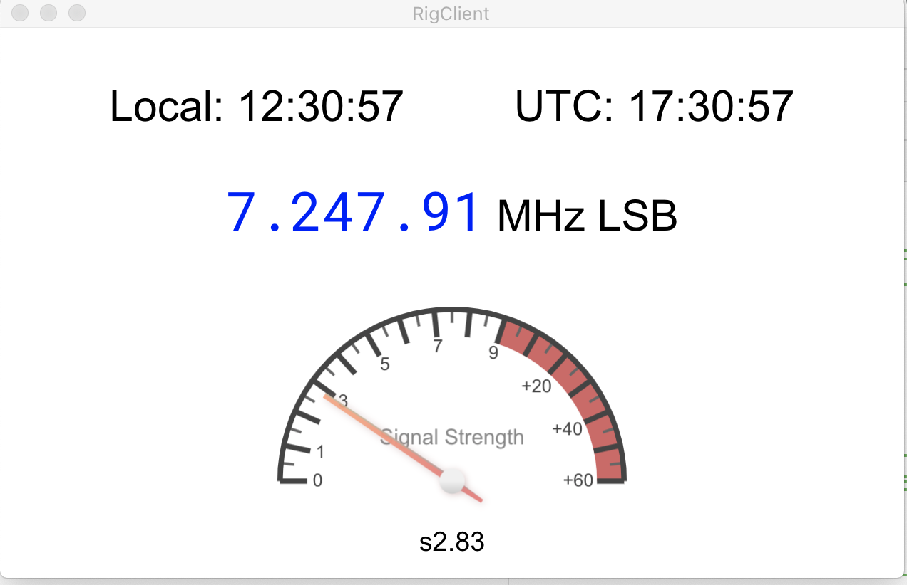

# RigClient

## Overview

This is an Electron-based desktop application that provides a dashboard view of an HF Ham Radio.

It uses (and requires the separate installation of) the <a href="https://hamlib.github.io">hamlib</a> Ham Radio Control Library.

Specifically, RigClient communicates over IP with either the <code>rigctl</code> application or the <code>rigctld</code> daemon, which in turn communicate with the radio via <a href="https://en.wikipedia.org/wiki/Computer_Aided_Transceiver">CAT Control</a>, usually via either USB or serial port.

Currently, RigClient displays the current local and UTC times,
the current VFO Frequency and mode, and the received signal strength (S-Meter). Additional features will likely be added as time allows.

## Running RigClient
Before you can run RigClient, you must have either rigctl or preferrably rigctld running and set up properly for your radio. 

Please refer to the <a href="https://hamlib.github.io">hamlib</a> website for help in setting it up with your radio.

If you are running RigClient on the same computer as rigctl/rigctld, then you can just run the application with no configuration.

If you are running RigClient on another computer, it will need to communicate with rigctl/rigctld over the network, and so must be told the hostname, by adding the command-line argument 
<code>--host=x.x.x.x</code> where <code>x.x.x.x</code> is replaced with the IP address of the computer running rigctl/rigctld.

So, for example, if the computer running rigctl/rigctld has the IP address of 192.168.1.100, you would run <code>rigclient --host=192.168.1.100</code>

If you have changed the port number that rigctl/rigctld listens on to something other than the default port of 4532, you must also specify the port with the <code>--port</code> argument.

### Window Size
When run the first time, RigClient attempts to size its window to a reasonable size, and places it in the middle of the screen. Adjust the size and place it where you wish, and it will re-open at that size and position the next time you open it.

## Download

Builds are available for the following platforms:

<ul>
  <li style="margin-bottom: 10px;">
  <a href="https://github.com/rfreedman/rig-client/releases/download/v0.1.0/rigclient_0.1.0_armv7l.deb">
  Raspberry Pi (.deb for Linux ARM V7, tested on Raspberry Pi 4 / Raspbian OS)
  </a>
  </li>
  
  <li style="margin-bottom: 10px;">
  <a href="https://github.com/rfreedman/rig-client/releases/download/v0.1.0/RigClient-0.1.0.AppImage">
  Linux (.AppImage for Linux amd64, tested on Ubuntu 16.04) 
  </a>
  </li>
  
  <li style="margin-bottom: 10px;">
  <a href="https://github.com/rfreedman/rig-client/releases/download/v0.1.0/rigclient_0.1.0_amd64.snap">
  Linux (.snap for Linux amd64, tested on Ubuntu 16.04)
  </a> 
  </li>
  
  <li style="margin-bottom: 10px;">
   <a href="https://github.com/rfreedman/rig-client/releases/download/v0.1.0/RigClient-0.1.0.dmg">
  Mac OS (.dmg for macOS x86, tested on 2017 Macbook Pro, macOS Catalina 10.15.6)
  </a>
  </li>
  
  <li>
  <a href="https://github.com/rfreedman/rig-client/releases/download/v0.1.0/RigClient.Setup.0.1.0.exe">
  Windows (setup .exe, untested)
  </a>
  </li>
</ul>

## Source
Source code can be found at https://github.com/rfreedman/rig-client.

<a href="https://github.com/rfreedman/rig-client/issues">Bug reports</a> and pull requests welcome.

